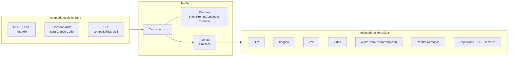
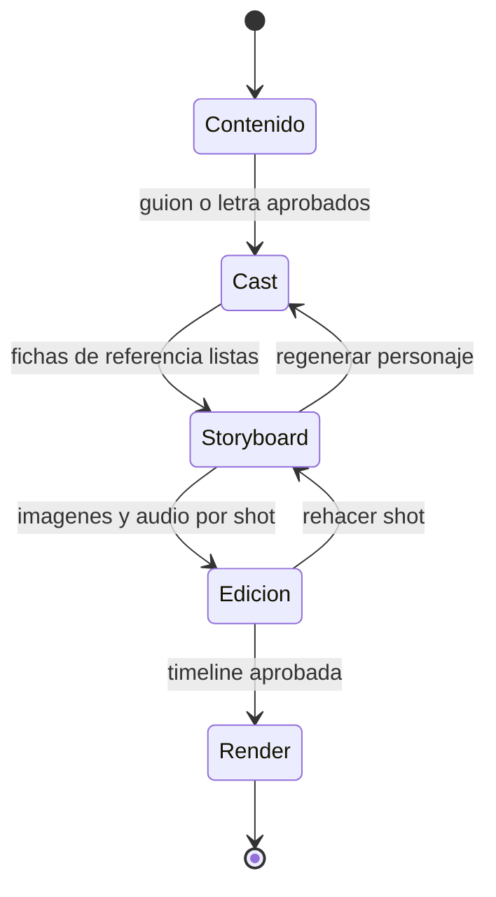
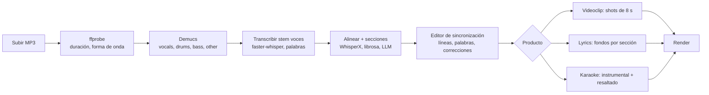
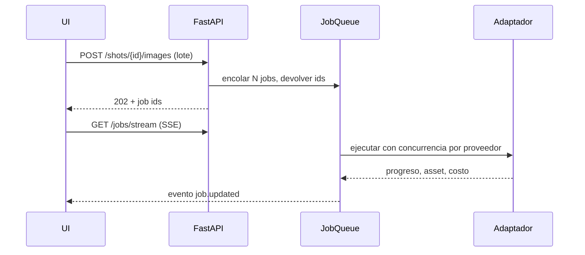

# Estudio IA — Arquitectura y plan de migración

2026-09-18 · @Someone

Recomendación: backend Python (FastAPI, arquitectura hexagonal) + frontend React/TypeScript + Remotion como servicio de render, migrando la skill `historias-fantasia` por fases con un patrón *strangler* que reutiliza los 20+ scripts existentes como adaptadores hasta reemplazarlos.

## 1. Decisión de stack: Python + FastAPI + React

Python gana sobre Java porque todo lo que ya existe y todo lo que falta es Python-first. Java sólo tendría sentido para un producto multi-tenant empresarial, que no es el caso.

| Criterio | Python (FastAPI) | Java (Spring Boot) |
| --- | --- | --- |
| Código existente reutilizable | 20+ scripts, \~8.000 líneas, tests `unittest` | 0 líneas; reescritura total |
| Demux de audio (Demucs), transcripción (faster-whisper, WhisperX) | Nativo, PyTorch | Sólo vía subprocess o servicio externo |
| SDKs de IA (Gemini, ElevenLabs, Anthropic, DashScope) | Oficiales y al día | Existen, pero llegan tarde o incompletos |
| Servidor local (Lemonade, OpenAI-compatible) | Cliente HTTP trivial | Igual de trivial |
| Render de video | Remotion exige Node de todos modos | Idem |
| Tipado y arquitectura hexagonal | `Protocol` + Pydantic + inyección simple | Interfaces, más ceremonia |
| Toolchain ya instalado en la máquina | Python 3.13, uv, Node 24, ffmpeg 9 | JDK 21 |

Stack propuesto:

- **Backend:** Python 3.12+ con `uv`, FastAPI, Pydantic v2, SQLModel sobre SQLite. Hexagonal: dominio puro, casos de uso, puertos como `typing.Protocol`, adaptadores por proveedor.
- **Frontend:** React 19 + TypeScript + Vite + Tailwind + shadcn/ui, con `@remotion/player` para previsualizar el video en el navegador sin renderizar.
- **Render:** el proyecto Remotion actual (`video-prototype`) evoluciona a un *sidecar* Node que expone `renderMedia` por HTTP local. Las composiciones nuevas (lyrics, karaoke, videoclip) viven ahí.
- **Jobs:** ejecutor asíncrono en proceso con tabla de jobs persistida; el puerto permite migrar a Huey/arq sin tocar casos de uso.
- **Contratos compartidos:** OpenAPI generado por FastAPI → tipos TypeScript (`openapi-typescript`); un solo `timeline.json` como contrato entre backend y Remotion.

La app es *local-first* y mono-usuario: corre en tu máquina, usa Lemonade Server para lo gratuito y sale a la nube sólo cuando el ruteo de proveedores lo indica (sección 9).

## 2. Inventario: qué se migra y a qué se convierte

La skill tiene dos capas: los 11 pasos de `SKILL.md` (elicitación + escritura con LLM) y los comandos on-demand (scripts que llaman APIs). Las dos se convierten en casos de uso; la primera además aporta las plantillas de prompt.

| Hoy (skill) | Mañana (app) | Estrategia |
| --- | --- | --- |
| Pasos 1-5: estilo, origen, tono, parámetros, estilo visual | Wizard paso 1 "Contenido" (formulario + chat asistido) | Reescribir como UI; los defaults de la skill pasan a ser valores iniciales |
| Paso 6 `canon.md` | Caso de uso `GenerateCanon` con plantilla de prompt | El texto de la skill se convierte en prompt template versionado |
| Paso 7 `personajes.json` / `escenarios.json` | Entidades `Character` / `Location` + `GenerateCast` | Esquemas JSON existentes → modelos Pydantic |
| Paso 8 casting de voces, `voces_pool.json`, catálogo ElevenLabs | `VoicePool` a nivel canal + `VoiceCatalogPort` | `fetch_voice_catalog.py`, `search_voice_catalog.py` |
| Paso 9.1 prosa `capitulo.md` | `WriteChapterProse` | Prompt template + editor en UI |
| Paso 9.2 `produccion.md` (tabla) | `DeriveProductionSheet` → filas `Shot` en DB | Parser de `build_prompts.py` se reutiliza para importar historias existentes |
| Paso 9.3 / `audit_production.py` | Linter de hoja de producción en vivo + `AuditShots` con LLM local | Lógica pura reutilizable tal cual |
| Paso 10 `build_prompts.py`, `build_full_prompts.py`, `translate_prompts.py` | Servicio de dominio `PromptComposer` (anchor por imagen o texto completo) | Extraer funciones puras; ya tienen tests |
| Paso 11 `build_manuscript.py` | `ExportManuscript` (Markdown, EPUB) | Trivial |
| `create_character_sheets*.py` | `GenerateReferenceSheets` vía `ImageGenerationPort` | Adaptador Gemini + Lemonade |
| `create_images.py`, `create_images_local.py` | `GenerateShotImages` (batch job) | Adaptadores Gemini y Lemonade (Flux2/Qwen + RealESRGAN) |
| `create_audio*.py`, `create_dialogue.py` | `GenerateShotAudio` vía `TTSPort` | Adaptadores ElevenLabs y Lemonade MOSS |
| `create_video_wan.py`, `create_video_google.py`, `create_video_omni.py` | `AnimateShot` vía `VideoGenerationPort` | Adaptadores WAN 2.7, Veo 3.1, Gemini Omni |
| `build_scenes.py`, `build_season.py`, Remotion `Capitulo` | `BuildTimeline` + `RenderPort` (sidecar Remotion) | `scenes.json` se generaliza a `timeline.json` |
| `export_to_flow.py`, `migrate_assets_formato.py` | Exportadores / importador de proyectos legacy | Baja prioridad |
| `video-clip-creator` (transcribe.py) y `music-audiovisual-producer` | Pipeline de música (sección 6) | Reutilizar `transcribe.py` como adaptador |

Lo que **no** se migra: la convención de rutas cambia lo mínimo. Los assets siguen en `{proyecto}/capitulo-N/assets/{ancho}x{alto}/imagenes|videos/` y `assets/audio/`, así los 5 GB ya generados de *La bruja del espejo* y *Seis meses antes del abismo* se importan sin mover archivos.

## 3. Modelo de dominio

Un solo núcleo sirve a los cuatro productos: todo termina siendo una **línea de tiempo de shots** con imagen o video, audio y texto en pantalla. Lo que cambia por producto es de dónde salen los shots y qué audio manda.

```mermaid
flowchart TD
  P[Project<br/>kind: story | music_video | lyrics | karaoke]
  P --> CAST[Cast<br/>Character, Location, Voice]
  P --> SRC[Source]
  SRC --> ST[Story<br/>Canon, Chapter, prose]
  SRC --> TR[Track<br/>audio, Stems, Transcript, LyricLine, Section]
  ST --> SH[Shot]
  TR --> SH
  SH --> AS[Asset<br/>image, video, audio, sheet, stem, srt]
  SH --> TL[Timeline<br/>timeline.json]
  TL --> R[Render<br/>mp4 por formato]
  AS -.-> J[Job<br/>estado, progreso, costo]
```

El `Shot` es la unidad central: en historias equivale a una fila de `produccion.md`; en música a una ventana de la canción. Los `Job` producen `Asset`s y nunca tocan el dominio directamente.

| Entidad | Campos clave | Origen en la skill |
| --- | --- | --- |
| `Project` | slug, kind, estilo visual, tono NORMAL/SAFE, plataformas, formatos (16:9, 9:16), ruta en disco | `historia_config.json` |
| `Canon` | logline, reglas del sistema, glosario, línea de tiempo, tracker, esqueleto de temporada | `canon.md` |
| `Chapter` | número, título, prosa, estado (borrador, hoja derivada, assets, renderizado) | `capitulo.md` + carpeta |
| `Shot` | orden, tipo (narración, diálogo, instrumental, letra), personajes, escenario, sub-escenario, momento del día, texto, prompt imagen, prompt video, cámara, duración estimada y real, sfx | fila de `produccion.md` / `prompts.json` |
| `Character` | id, nombre, rol, tokens visuales, `prompt_anchor`, variantes de vestuario, fichas de referencia (paneles), voz | `personajes.json` |
| `Location` | id, descripción fija, variantes de encuadre, fichas por ángulo | `escenarios.json` |
| `Voice` / `VoicePool` | proveedor, voice\_id, modelo TTS, atributos, historial de uso a nivel canal | `voces.json`, `voces_pool.json` |
| `Asset` | tipo, ruta, ancho×alto, proveedor, modelo, seed, hash del prompt, versión, seleccionado | carpetas `assets/` + logs `image_generation_log_local.json` |
| `Track` | archivo original, duración, BPM, tonalidad, stems (vocals, drums, bass, other, instrumental) | nuevo (Demucs) |
| `Transcript` / `LyricLine` | palabras con inicio, fin, confianza y flag `suspect`; líneas editadas por el usuario | `transcribe.py` (`.words.json`) |
| `Section` | intro, verso, coro, puente, solo, outro, con rango de tiempo | nuevo |
| `Timeline` | shots resueltos con assets elegidos, transiciones, subtítulos, intro/outro, pista de audio maestra | `scenes.json` generalizado |
| `Job` | tipo, proveedor, entrada, estado, progreso, logs, costo estimado y real, reintentos | `failed_*.json` |

Regla de versionado: cada generación crea un `Asset` nuevo; el shot apunta al seleccionado. Eso reproduce el "Generation history" de MagicLight y evita perder resultados al regenerar.

## 4. Arquitectura hexagonal

El dominio y los casos de uso no conocen ningún proveedor. Cada capacidad de IA es un puerto; cada proveedor es un adaptador que declara qué puertos implementa. Cambiar Gemini por Flux local es configuración, no código.



Puertos de salida y adaptadores previstos. Los marcados con (local) corren en Lemonade Server, que ya tiene descargados esos modelos.

| Puerto | Operaciones | Adaptadores iniciales | Después |
| --- | --- | --- | --- |
| `TextGenerationPort` | completar, JSON estructurado, streaming | Anthropic Claude, Gemini, OpenAI-compatible (Lemonade gemma4 / gpt-oss, LM Studio, Ollama) | — |
| `ImageGenerationPort` | texto→imagen, imagen+referencias→imagen, edición | Gemini (Nano Banana Pro), Lemonade Flux2 / Qwen Image (local) | Replicate, fal, ComfyUI |
| `ImageUpscalePort` | ampliar ×2/×4 | Lemonade RealESRGAN anime (local) | — |
| `TTSPort` | síntesis por fila, diálogo multi-voz, audio tags | ElevenLabs (v3, multilingual v2), Lemonade MOSS-TTS (local) | OpenAI speech, Azure |
| `VoiceCatalogPort` | buscar y previsualizar voces | ElevenLabs Voice Library, MOSS-VoiceGen (diseño de voz local) | — |
| `VideoGenerationPort` | imagen→video, con audio *driving* opcional | WAN 2.7 (DashScope), Veo 3.1, Gemini Omni | Kling, Seedance, ComfyUI Wan local |
| `SourceSeparationPort` | separar stems | Demucs htdemucs\_6s (local, PyTorch) | LALAL.ai, Moises API |
| `TranscriptionPort` | palabras con tiempos, idioma, alineación forzada | faster-whisper large-v3-turbo (local), Lemonade Whisper (local) | WhisperX para alineación por palabra, ElevenLabs Scribe |
| `MusicAnalysisPort` | BPM, tonalidad, secciones, energía | librosa + LLM sobre la letra | Essentia |
| `AudioGenerationPort` | SFX y música de fondo | Lemonade ThinkSound-SFX y ACE-Step (local) | ElevenLabs SFX, Suno |
| `TranslationPort` | prompts ES→EN | Lemonade translategemma (local) o el LLM configurado | — |
| `RenderPort` | render de composición, concatenación, thumbnails | Remotion sidecar + ffmpeg | Remotion Lambda |
| `MediaProbePort` | duración, resolución, forma de onda | ffprobe / ffmpeg | — |
| `ProjectRepository`, `AssetStorePort` | persistencia estructurada y binaria | SQLite + sistema de archivos | Postgres + S3 |
| `SecretStorePort` | leer y guardar API keys | Windows Credential Manager vía `keyring` | Vault |
| `JobQueuePort` | encolar, progreso, cancelar | ejecutor asyncio en proceso | Huey (SQLite), arq (Redis) |

Tres reglas de diseño que evitan que el hexágono se degrade:

1. **Los puertos hablan en tipos del dominio** (`ImageRequest` con estilo, referencias, ancho×alto, seed), nunca en payloads de proveedor. La traducción al JSON de Gemini o Lemonade vive sólo dentro del adaptador, igual que hoy la tienen los scripts y sus tests.
2. **Un `ProviderRegistry` resuelve el adaptador por tarea** (sección 9). Los casos de uso piden "un generador de imágenes para este proyecto", no "Gemini".
3. **Los adaptadores heredan los tests de contrato actuales.** Los `test_create_*.py` ya aseveran URLs y payloads verificados contra APIs reales; se portan tal cual al adaptador correspondiente.

## 5. Wizard común de 4 pasos

Los cuatro productos comparten la misma barra de progreso (Contenido → Cast → Storyboard → Edición), como MagicLight. Cada paso es un estado del `Project`; se puede volver atrás sin perder assets porque los shots conservan su historial.



| Paso | Historias cortas | Video musical animado | Lyrics video | Karaoke |
| --- | --- | --- | --- | --- |
| **1. Contenido** | Estilo, origen, tono, plataforma; chat que genera canon, prosa por capítulo y hoja de producción editable en tabla | Subir MP3, demux, transcripción, análisis narrativo de la letra, secciones | Subir MP3, demux, transcripción, corregir letra | Igual que lyrics; además elegir stem instrumental como pista base |
| **2. Cast y escenarios** | Personajes, escenarios, voces; generar fichas de referencia; biblioteca reutilizable entre proyectos | Personajes implícitos en la letra + localizaciones; fichas | Tema visual y paleta; sin personajes (opcional: artista) | Tema visual, tipografía, colores de resaltado |
| **3. Storyboard** | Un shot por fila: imagen (varias versiones), audio TTS, animar shot (i2v), pose/expresión, regenerar con seed | Un shot por ventana de 8 s: imagen + clip i2v sin audio propio | Un fondo por sección o por línea: imagen o loop de video generado | Fondos por sección; preview de resaltado palabra a palabra |
| **4. Edición y render** | Timeline con Ken Burns, subtítulos, intro/outro, pausa entre escenas, formato 16:9 y 9:16, shorts derivados | Timeline sincronizada al audio original, cortes en el beat | Tipografía cinética, transiciones, letra sincronizada | Resaltado estilo karaoke sobre instrumental (o mezcla original), cuenta regresiva por línea |

Detalles que hacen la diferencia en la UI:

- **Tabla de producción editable** en el paso 1, con linter en vivo (lo que hoy hace `audit_production.py`): ids entre corchetes sin personaje, escenario genérico dominante, momento del día faltante.
- **Biblioteca de personajes** compartida entre proyectos (como "Character Library" de MagicLight), con filtro por historia, favoritos y contador de usos; el `VoicePool` a nivel canal encaja aquí.
- **Panel por shot** en el paso 3: prompt editable, referencias usadas, historial de generaciones, botones Regenerar / Animar / Voz, y costo estimado antes de confirmar un lote.
- **Preview real** en el paso 4 con `@remotion/player`, sin esperar el render.
- **Chat lateral** en todos los pasos: el mismo LLM que escribe puede editar el shot seleccionado ("hazla más oscura", "acorta esta narración").

## 6. Pipeline de música

Todo parte de un MP3/WAV. El demux ocurre siempre (no sólo para karaoke): transcribir el stem de voces reduce alucinaciones de Whisper, y el instrumental es la base del karaoke.



| Etapa | Herramienta | Salida | Notas |
| --- | --- | --- | --- |
| Demux | Demucs `htdemucs_6s` local (CPU o GPU) | 4-6 stems WAV + `instrumental.wav` (mezcla sin voz) | Instalar en un venv aparte por el peso de PyTorch; alternativa API si la CPU tarda demasiado |
| Transcripción | faster-whisper `large-v3-turbo` sobre el stem de voces (ya existe `transcribe.py`) | palabras con inicio/fin/probabilidad, flag `suspect` | `--vad` apagado, como aprendió la skill |
| Alineación fina | WhisperX (wav2vec2) o re-alineación con la letra corregida por el usuario | tiempos por palabra estables | Necesario para karaoke; opcional para lyrics |
| Estructura | librosa (BPM, onsets, energía) + LLM sobre la letra | `Section` (intro, verso, coro, puente, solo, outro) | El coro repetido se detecta por texto repetido |
| Editor de sync | UI con forma de onda (wavesurfer.js), líneas arrastrables, reproducir tramo, dividir/unir líneas | `LyricLine` editadas, exportables a SRT/LRC | La corrección humana es el paso que más calidad aporta |
| Shots | ventanas de 8 s (videoclip) o una por sección/línea (lyrics, karaoke) | `Shot` con letra, prompt imagen y prompt video | Reglas SAFETY/PLATFORM/STYLE de `video-clip-creator` |
| Fondos | `ImageGenerationPort` + opcional i2v en loop | imágenes o clips de 5-8 s | Para lyrics y karaoke basta un fondo por sección con Ken Burns |

Composiciones de render que este pipeline alimenta (sección 7): `MusicVideo`, `LyricsVideo`, `Karaoke`. Las tres reciben el mismo `timeline.json` con la pista maestra (`original.mp3` o `instrumental.wav`), la lista de líneas con tiempos por palabra y los shots con sus assets.

## 7. Motor de render: Remotion como sidecar

El proyecto `video-prototype` ya resuelve lo difícil (Ken Burns, subtítulos escalados, 16:9 y 9:16, intro/outro, temporada). Se convierte en un servicio Node que el backend invoca, y sus composiciones se parametrizan por props en vez de leer `scenes.json` del disco.

| Pieza | Hoy | Propuesta |
| --- | --- | --- |
| Entrada | `src/scenes.json` regenerado por `build_scenes.py` | `timeline.json` pasado como `inputProps`; `build_scenes.py` se convierte en el caso de uso `BuildTimeline` |
| Assets | `HISTORIA_PATH` servido como `public/` | Servidor estático del backend (`/media/{project}/...`) o ruta local absoluta en render |
| Render | `npx remotion render` a mano | `@remotion/renderer` (`renderMedia`) en un servidor Express local con progreso por SSE |
| Preview | Remotion Studio aparte | `@remotion/player` embebido en el paso 4, mismo bundle de composiciones |
| Composiciones | `Capitulo`, `Separador`, `Cierre` | + `MusicVideo`, `LyricsVideo`, `Karaoke`, `Short` (recorte por rango de shots) |
| Temporada | `build_season.py` + ffmpeg concat | Caso de uso `BuildSeason` sobre `RenderPort.concat` |

`timeline.json` es el contrato estable entre Python y Node. Un solo esquema (Pydantic → JSON Schema → tipos TS) con: `meta` (canal, título, ancho, alto, fps, outro), `audio` (pista maestra opcional, volumen, ducking), `shots` (imagen o video, audio propio, texto en pantalla, movimiento de cámara, duración real, transición) y `lyrics` (líneas con palabras y tiempos, estilo de resaltado).

Decisiones técnicas ya validadas que se conservan: la duración real se mide con ffprobe (nunca la estimada), dimensiones siempre pares, pausa de 1 s entre escenas salvo que la siguiente sea un clip animado, y una sola relación de aspecto por temporada.

Licencia: Remotion es gratuita para individuos y equipos de hasta 3 personas; si el estudio llega a monetizarse como empresa mayor, hace falta licencia.

## 8. Jobs, colas y progreso

Toda generación (imagen, audio, video, demux, render) es un `Job` persistido; el UI nunca espera una respuesta HTTP larga. Empieza simple y crece detrás del puerto.



- **Fase inicial:** ejecutor `asyncio` en el mismo proceso, con tabla `jobs` en SQLite; sobrevive reinicios porque los jobs pendientes se recuperan al arrancar. Sin Redis ni Docker (no hay Docker en la máquina).
- **Concurrencia por proveedor:** semáforos configurables (Lemonade: 1, Gemini: 3, ElevenLabs: 2) y *rate limit* con reintento exponencial, como ya hacen los scripts con `failed_*.json`.
- **Idempotencia:** clave = hash(prompt, referencias, modelo, seed, formato). Repetir un lote no regenera lo que ya existe salvo `force`, misma semántica que `--force` y `--missing-only`.
- **Progreso:** SSE (`/jobs/stream`) alcanza para una app local; WebSocket sólo si se agrega colaboración.
- **Cancelación y costo:** cada job registra costo estimado antes y real después; un lote muestra el total antes de confirmar.
- **Escalado:** el puerto `JobQueuePort` permite pasar a Huey (SQLite) o arq (Redis) sin tocar casos de uso; Remotion Lambda para render remoto.

## 9. Panel de proveedores de IA

El panel es la cara visible del `ProviderRegistry`: cada proveedor declara capacidades, modelos, parámetros y costo; el usuario decide qué proveedor atiende cada tarea, con fallback.

| Elemento | Qué contiene |
| --- | --- |
| Proveedor | nombre, tipo (nube o local), URL base, estado de salud (ping), API key (sólo se muestra si está cargada) |
| Capacidad | `text`, `image`, `image_edit`, `upscale`, `tts`, `voice_design`, `video_i2v`, `video_lipsync`, `transcribe`, `separate`, `music`, `sfx`, `translate` |
| Modelo | id, capacidades, resoluciones y duraciones soportadas, precio por unidad, `preset` de parámetros (ej. Flux2: steps 4, cfg 1; Qwen: steps 20-36) |
| Ruteo por tarea | tabla "tarea → proveedor principal → fallback": *imágenes de shot: Lemonade Flux2 → Gemini*; *fichas de referencia: Gemini*; *TTS narración: ElevenLabs v3 → MOSS local* |
| Override por proyecto | un proyecto puede fijar otro ruteo (ej. una historia realista usa Gemini para todo) |
| Costos | acumulado por proyecto y por mes, con desglose por proveedor |

Reglas:

- **Secretos fuera de la base de datos.** Las API keys van al Windows Credential Manager mediante `keyring`; la DB guarda sólo la referencia. Nunca se exportan ni viajan al frontend. Las variables de entorno actuales (`GEMINI_API_KEY`, `ELEVENLABS_API_KEY`, `ALI_API_KEY`, `GOOGLE_API_KEY`) siguen funcionando como fuente inicial.
- **Descubrimiento automático en local.** El adaptador Lemonade consulta `/api/v1/models` y registra lo descargado con sus etiquetas (hoy: Flux-2-Klein-4B, Qwen-Image, MOSS-TTS, Whisper-Large-v3-Turbo, RealESRGAN, ACE-Step, ThinkSound, gemma4). Lo mismo aplica a Ollama y LM Studio.
- **Prueba de humo por proveedor.** Botón "Probar" que ejecuta una generación mínima y muestra latencia y costo; equivale al consejo de la skill de correr `--escena N` antes de un capítulo entero.
- **Contratos verificados.** Cada adaptador conserva sus tests de payload; una API nueva o no verificada (como Gemini Omni hoy) se marca `experimental` en el panel.

## 10. Estructura del repositorio y persistencia

Monorepo con tres aplicaciones y un paquete de contratos. El dominio no importa nada de `adapters/`; una prueba de arquitectura (`import-linter`) lo hace cumplir.

```
estudio-ia/
  backend/
    app/
      domain/            # entidades, value objects, servicios puros (PromptComposer, TimelineBuilder)
        story/  music/  cast/  render/  jobs/
      application/
        ports/           # Protocols: TextGenerationPort, ImageGenerationPort, TTSPort, ...
        use_cases/       # GenerateCanon, DeriveProductionSheet, GenerateShotImages, BuildTimeline, ...
      adapters/
        inbound/         # api/ (FastAPI routers, SSE), mcp/ (servidor MCP), cli/
        outbound/        # llm/ image/ tts/ video/ audio/ render/ storage/ repository/ secrets/
      config/            # settings, ProviderRegistry, ruteo por tarea
      prompts/           # plantillas versionadas extraídas de SKILL.md y references/
    tests/               # unit (dominio), contract (payloads por adaptador), e2e (API)
    pyproject.toml       # uv
  frontend/              # Vite + React + TS + Tailwind + shadcn + @remotion/player
  render/                # proyecto Remotion: composiciones + servidor de render
  packages/contracts/    # JSON Schema de timeline.json y OpenAPI → tipos TS generados
  workspace/             # datos del usuario (fuera de git): proyectos, biblioteca, cache
```

Persistencia, la decisión con más consecuencias:

| Dato | Dónde vive | Por qué |
| --- | --- | --- |
| Estructura (proyectos, shots, personajes, jobs, config) | SQLite vía SQLModel, un archivo por workspace | Ediciones en UI fila a fila no pueden depender de reescribir tablas Markdown |
| Binarios (imágenes, audio, video, stems) | Sistema de archivos, misma convención de carpetas actual | 5 GB ya generados se importan sin copiar; fácil de respaldar y abrir con otras herramientas |
| Prosa larga (canon, capítulos, manuscrito) | Archivos Markdown en la carpeta del proyecto, indexados en DB | Editables con cualquier editor y por la skill de Claude |
| Exportación | `produccion.md`, `personajes.json`, `prompts.json` generados bajo demanda | Compatibilidad con los scripts y la skill actuales mientras conviven |
| Importación | escaneo de una carpeta de historia existente usando el parser de `build_prompts.py` | Primer entregable de la fase 0 |

La skill `historias-fantasia` no muere: se convierte en cliente de la app mediante el servidor MCP (`crear imágenes del capítulo 3` llama al mismo caso de uso que el botón del UI). Un solo motor, dos interfaces.

## 11. Hoja de ruta por fases

Cada fase termina con algo usable sobre datos reales (*La bruja del espejo*), no con infraestructura sola. Duraciones estimadas para una persona con ayuda de Claude Code.

| Fase | Semanas | Entregable verificable | Reutiliza |
| --- | --- | --- | --- |
| **0. Cimientos** | 1-2 | Monorepo, esqueleto hexagonal, SQLite, ProviderRegistry con Lemonade + Gemini + ElevenLabs, panel de proveedores con prueba de humo, importador de historias existentes y visor de capítulos/shots con sus assets | Parser de `build_prompts.py`, esquemas JSON |
| **1. Contenido y cast** | 2-3 | Wizard pasos 1-2 para historias: chat que genera canon, personajes, escenarios y voces; tabla de producción editable con linter; fichas de referencia generadas | Prompts de `SKILL.md`, `create_character_sheets`, `audit_production`, catálogo de voces |
| **2. Storyboard** | 2-3 | Generación por lote de imágenes (Gemini y Flux2 local), audio TTS por shot, historial de versiones, animar shot con WAN/Veo/Omni, jobs con progreso y costo | `create_images*`, `create_audio*`, `create_video_*`, `build_full_prompts` |
| **3. Render** | 2 | Sidecar Remotion con `timeline.json`, preview con Player en el paso 4, export 16:9 y 9:16, shorts por rango, temporada completa | `video-prototype`, `build_scenes`, `build_season` |
| **4. Música: lyrics y karaoke** | 3 | Subida de MP3, demux, transcripción, editor de sincronización, fondos por sección, composiciones `LyricsVideo` y `Karaoke` | `transcribe.py`, reglas de `video-clip-creator` |
| **5. Videoclip animado y cierre** | 2-3 | Shots de 8 s con cast reutilizado del paso 2, cortes en el beat, servidor MCP para la skill, exportación EPUB del manuscrito, biblioteca de personajes entre proyectos | Todo lo anterior |

Orden de las fases 3 y 4: si el karaoke urge más que renderizar historias desde la web, se puede adelantar la fase 4, porque el editor de sincronización sólo depende de la fase 0.

Primer paso concreto sugerido: fase 0 en una carpeta hermana `estudio-ia/`, dejando intactos `historias/` y `video-prototype/` hasta que la fase 3 los absorba.

## 12. Mejoras sugeridas, riesgos y decisiones abiertas

Mejoras que van más allá de copiar MagicLight y aprovechan lo que ya tenés:

- **Local-first con ruteo por costo.** Borradores con Flux2/MOSS locales, versión final con Gemini/ElevenLabs; el mismo shot conserva ambas versiones.
- **Bloqueo de identidad.** Fichas de personaje y escenario como referencias obligatorias en cada generación, con aviso cuando un shot se generó sin ellas. Resuelve el problema de `outfit_variantes` generando una segunda ficha por atuendo.
- **Linter de producción en vivo** en la tabla, en vez de una auditoría posterior.
- **Estimador de costo** antes de cada lote y por proyecto.
- **Karaoke con instrumental real** gracias al demux, más modo "voz guía" al volumen que se elija.
- **Doblaje multi-idioma:** traducir textos con translategemma o el LLM y regenerar TTS, reutilizando imágenes; abre el canal a otro idioma con costo marginal.
- **Shorts automáticos** a partir de la sección "Shorts derivados": recorte por rango de shots, re-encuadre 9:16 y título generado.
- **Metadatos de publicación** (título, descripción, tags, miniatura) generados por LLM al final del paso 4.
- **SFX y música de fondo generados** localmente (ThinkSound, ACE-Step) desde la columna `SFX/Musica`, que hoy no se usa.
- **Ebook** desde el manuscrito (EPUB) con las imágenes de escena como ilustraciones.

Riesgos y cómo mitigarlos:

| Riesgo | Impacto | Mitigación |
| --- | --- | --- |
| Demucs y WhisperX requieren PyTorch; la máquina no tiene GPU NVIDIA (Ryzen AI, NPU) | Demux lento en CPU (minutos por canción) | Venv aparte con torch CPU, ejecutar como job en segundo plano; fallback a API de separación |
| APIs no verificadas (Gemini Omni) o cambiantes (Veo, WAN) | Adaptadores rotos sin aviso | Tests de contrato + prueba de humo en el panel + etiqueta `experimental` |
| Migrar datos existentes con variantes manuales (`* - copia`, `.bak`) | Importador confundido | Importar sólo archivos con nombre canónico, como ya hace `migrate_assets_formato.py`; el resto queda visible como "sin clasificar" |
| Deriva del hexágono (lógica de proveedor filtrándose al dominio) | Pérdida de configurabilidad | `import-linter` en CI y revisión de puertos en cada adaptador nuevo |
| Alcance: cuatro productos a la vez | Nada termina | Fases con entregable real; música recién en fase 4 |

Decisiones que conviene tomar antes de la fase 0:

1. Nombre del producto y de la carpeta del repo (aquí se usa `estudio-ia` como marcador).
2. LLM principal para escritura: Claude vía API (calidad, costo por capítulo) o gemma4/gpt-oss local (gratis, más lento y menos fino). La skill hoy escribe con Claude Code; el panel permite ambos.
3. Si el editor de la tabla de producción vive en la web (recomendado) o si `produccion.md` sigue siendo la fuente de verdad editada a mano.
4. Si el render remoto (Remotion Lambda) interesa a corto plazo o todo se renderiza en la máquina local.
